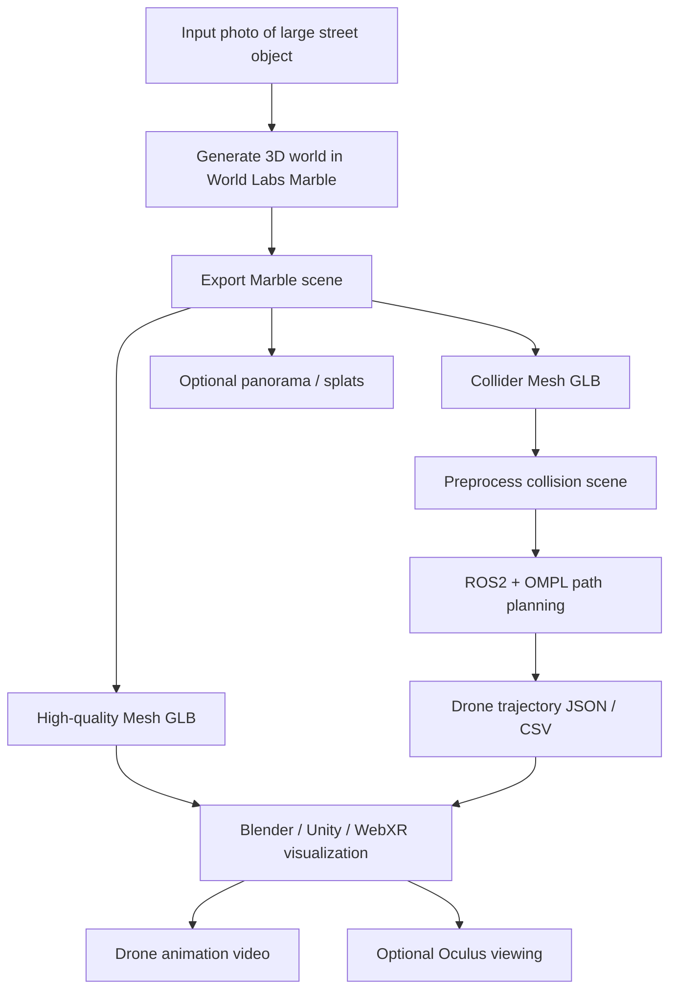

# Drone World Pipeline

## Summary

1. Take a photo of a large street object.
2. Generate a virtual 3D world in World Labs Marble.
3. Export two Marble Pro assets:
   - `High-quality Mesh GLB` for visual rendering.
   - `Collider Mesh GLB` for planning and collision checking.
4. Clean and scale the scene if needed in Blender.
5. Use ROS2 + OMPL to define start/target points and calculate a safe drone
   trajectory around the object.
6. Export the trajectory as `trajectory.json` or `trajectory.csv`.
7. Load the visual mesh and trajectory into Blender, Unity, or WebXR.
8. Animate the drone/camera along the planned path.
9. For Oculus:
   - fastest: render a 360/video animation and view it in the headset;
   - more interactive: build a WebXR or Unity viewer.

## Roles

- Marble creates the 3D world.
- ROS2 + OMPL plans the drone path.
- Blender, Unity, or WebXR renders and animates the final result.
- ROS2 does not directly export an Oculus-ready scene.
